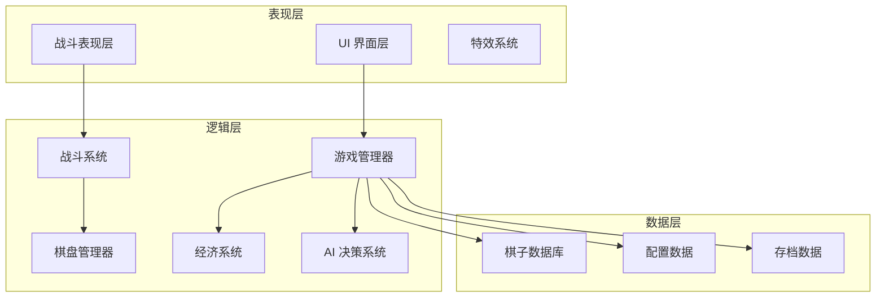

# 封狼居胥自走棋 - 技术设计文档

Feature Name: fenglangjxu-autochess
Updated: 2026-04-16

## 描述

封狼居胥是一款以西汉名将霍去病远征匈奴为背景的轻松娱乐向自走棋小程序游戏。游戏使用 Cocos Creator 3.x 引擎开发，支持发布到微信小程序平台。

核心特色：
- Q 版画风，轻松娱乐向
- 汉匈双阵营对抗，80+ 棋子池
- 三维度羁绊系统（阵营 + 职业 + 名将）
- 自由站位 + 冲锋动态战斗
- 中棋盘设计（1200x800 像素）

## 架构



**架构说明：**

1. **表现层（View Layer）**
   - UI 界面层：负责所有用户界面渲染和交互
   - 战斗表现层：负责棋子模型、动画、移动表现
   - 特效系统：负责技能特效、战斗反馈、UI 动画

2. **逻辑层（Logic Layer）**
   - 游戏管理器：核心状态机，控制游戏流程
   - 棋盘管理器：棋子管理、站位、碰撞检测
   - 战斗系统：伤害计算、目标选择、技能触发
   - 经济系统：金币管理、利息计算、商店生成
   - AI 决策系统：AI 招募、布阵、战斗决策

3. **数据层（Data Layer）**
   - 棋子数据库：所有棋子的属性、技能、羁绊定义
   - 配置数据：游戏规则参数、平衡性配置
   - 存档数据：玩家数据、战绩、解锁内容

## 组件和接口

### 核心组件

#### 1. GameManager（游戏管理器）
- **职责**：控制游戏主循环和状态流转
- **核心方法**：
  - `startGame()` - 初始化游戏
  - `startRound()` - 开始回合
  - `startCombat()` - 进入战斗阶段
  - `endRound()` - 结束回合
  - `checkGameEnd()` - 检查游戏结束条件

#### 2. Chess（棋子类）
- **属性**：
  - `id`: string - 棋子唯一标识
  - `name`: string - 棋子名称
  - `camp`: enum - 阵营（汉军/匈奴）
  - `profession`: enum - 职业（骑兵/弩兵/等）
  - `cost`: number - 费用（1-5）
  - `star`: number - 星级（1-3）
  - `hp`: number - 生命值
  - `attack`: number - 攻击力
  - `defense`: number - 防御力
  - `speed`: number - 移动速度
  - `range`: number - 攻击范围
  - `energy`: number - 当前能量值
  - `skill`: object - 技能定义
- **核心方法**：
  - `moveTo(target)` - 移动到目标
  - `attackTarget(target)` - 攻击目标
  - `castSkill()` - 释放技能
  - `takeDamage(amount)` - 承受伤害
  - `gainEnergy(amount)` - 获取能量

#### 3. Board（棋盘管理器）
- **属性**：
  - `width`: number - 棋盘宽度（1200）
  - `height`: number - 棋盘高度（800）
  - `myChessList`: array - 我方棋子列表
  - `enemyChessList`: array - 敌方棋子列表
- **核心方法**：
  - `addChess(chess, position)` - 添加棋子
  - `removeChess(chess)` - 移除棋子
  - `getAllChess()` - 获取所有棋子
  - `getNearestEnemy(chess)` - 获取最近敌人
  - `checkCollision(chess)` - 检测碰撞

#### 4. CombatSystem（战斗系统）
- **职责**：处理战斗逻辑和伤害计算
- **核心方法**：
  - `startBattle()` - 开始战斗
  - `update(dt)` - 战斗更新循环
  - `calculateDamage(attacker, target)` - 计算伤害
  - `selectTarget(attacker)` - 选择攻击目标
  - `checkBondBonus()` - 计算羁绊加成
  - `endBattle()` - 结束战斗

#### 5. EconomySystem（经济系统）
- **属性**：
  - `gold`: number - 当前金币
  - `interest`: number - 利息
  - `winStreak`: number - 连胜次数
  - `loseStreak`: number - 连败次数
- **核心方法**：
  - `addGold(amount, source)` - 增加金币
  - `spendGold(amount, type)` - 消费金币
  - `calculateInterest()` - 计算利息
  - `refreshShop()` - 刷新商店
  - `buyChess(cost)` - 购买棋子
  - `levelUp()` - 升级人口

#### 6. ShopSystem（商店系统）
- **核心方法**：
  - `generateShop(playerLevel)` - 生成商店
  - `refresh()` - 刷新商店
  - `buyChess(index)` - 购买棋子
  - `getChessPool(chessId)` - 获取棋子池剩余

#### 7. AISystem（AI 系统）
- **核心方法**：
  - `makeDecision(aiPlayer)` - AI 决策
  - `selectShopItems()` - 选择购买棋子
  - `arrangeFormation()` - 布阵
  - `chooseTarget()` - 战斗目标选择

### 接口定义

#### 棋子数据接口
```typescript
interface IChessData {
  id: string;
  name: string;
  camp: 'han' | 'xiongnu';
  profession: 'cavalry' | 'archer' | 'chariot' | 'mage' | 'warrior';
  cost: 1 | 2 | 3 | 4 | 5;
  baseStats: {
    hp: number;
    attack: number;
    defense: number;
    speed: number;
    range: number;
  };
  skill: ISkill;
  bonds: IBond[];
}

interface ISkill {
  name: string;
  description: string;
  energyCost: number;
  type: 'damage' | 'heal' | 'buff' | 'debuff' | 'control';
  target: 'self' | 'enemy' | 'ally' | 'area';
  effect: {
    damageRate?: number;
    healRate?: number;
    buffValue?: number;
    duration?: number;
  };
}

interface IBond {
  type: 'camp' | 'profession' | 'name';
  requirement: number;
  effect: string;
}
```

#### 游戏状态接口
```typescript
enum GameState {
  LOBBY = 'lobby',
  PREPARING = 'preparing',
  COMBAT = 'combat',
  ROUND_END = 'round_end',
  GAME_END = 'game_end'
}

interface IGameState {
  state: GameState;
  roundNumber: number;
  players: IPlayer[];
  chessPool: Record<string, number>;
}
```

## 数据模型

### 棋子数据库结构
```typescript
// 棋子主表
const ChessDatabase: Record<string, IChessData> = {
  'huoqubing': {
    id: 'huoqubing',
    name: '霍去病',
    camp: 'han',
    profession: 'cavalry',
    cost: 5,
    baseStats: { hp: 800, attack: 120, defense: 40, speed: 8, range: 1 },
    skill: {
      name: '封狼居胥',
      description: '对周围敌人造成 200% 攻击力伤害并提升自身 30% 攻速',
      energyCost: 6,
      type: 'damage',
      target: 'area',
      effect: { damageRate: 2.0, buffValue: 0.3, duration: 8 }
    },
    bonds: [
      { type: 'camp', requirement: 3, effect: '汉军全体攻击 +15%' },
      { type: 'profession', requirement: 4, effect: '骑兵冲锋速度 +40%' },
      { type: 'name', requirement: 3, effect: '封狼居胥组合：全体汉军攻击 +30%' }
    ]
  },
  // ... 其他 80+ 棋子
};
```

### 羁绊配置表
```typescript
const BondConfig = {
  // 阵营羁绊
  'han_camp': {
    3: '汉军全体攻击 +10%',
    5: '汉军全体攻击 +20%, 生命 +15%',
    7: '汉军全体攻击 +30%, 生命 +25%, 移动速度 +20%'
  },
  'xiongnu_camp': {
    3: '匈奴全体生命 +10%',
    5: '匈奴全体生命 +20%, 攻击 +15%',
    7: '匈奴全体生命 +30%, 攻击 +25%, 移动速度 +20%'
  },
  
  // 职业羁绊
  'cavalry': {
    2: '骑兵移动速度 +15%',
    4: '骑兵移动速度 +30%, 首次攻击伤害 +40%',
    6: '骑兵移动速度 +50%, 首次攻击伤害 +80%'
  },
  'archer': {
    2: '弩兵攻击范围 +1',
    4: '弩兵攻击范围 +2, 攻击力 +25%',
    6: '弩兵攻击范围 +3, 攻击力 +50%, 有 20% 概率暴击'
  },
  
  // 名将羁绊
  'fenglangjuxu': { // 霍去病 + 卫青 + 李广
    requirement: 3,
    effect: '汉军全体攻击 +30%, 霍去病技能伤害 +50%'
  },
  'xiongnu_kings': { // 左贤王 + 右贤王
    requirement: 2,
    effect: '狼骑兵移动速度 +50%, 攻击力 +20%'
  }
};
```

### 经济系统配置
```typescript
const EconomyConfig = {
  baseGold: 5, // 每回合基础金币
  interestCap: 50, // 利息计算上限
  interestRate: 0.1, // 利息率（每 10 金币 +1）
  refreshCost: 2, // 刷新商店消耗
  levelUpCost: [4, 8, 16, 24, 32], // 各级升级费用 [2→3, 3→4, ...]
  winStreakBonus: [1, 2, 3], // 连胜奖励 [3 连，4 连，5 连+]
  loseStreakBonus: [1, 2, 3], // 连败奖励
  chessCountByLevel: [3, 4, 5, 6, 7, 8, 9, 10] // 各人口可上阵棋子数
};
```

## 正确性属性

### 战斗系统不变量
1. **伤害计算公式**：`最终伤害 = 攻击力 × (100 / (100 + 防御力)) × 技能倍率 × 羁绊加成`
2. **能量获取**：每次攻击获取 10 点能量，被攻击获取 5 点能量
3. **攻击优先级**：最近目标 > 最低血量目标 > 随机目标
4. **移动碰撞**：棋子之间保持最小距离 50 像素，不可重叠

### 经济系统不变量
1. **利息向下取整**：`利息 = floor(金币 / 10)`，上限 5
2. **伤害计算公式**：基础伤害 + 未上场回合数 × 1
3. **棋子池权重**：高费棋子在棋子池中的数量更少

### 羁绊系统不变量
1. **羁绊激活阈值**：必须达到指定数量才激活
2. **羁绊叠加规则**：多个羁绊效果可叠加，但同类型取最高
3. **实时计算**：棋子上下场时立即重新计算羁绊

## 错误处理

### 异常场景处理

1. **网络异常（未来联机版）**
   - IF 网络断开连接 THEN 系统 SHALL 暂停游戏并显示重连提示
   - IF 重连失败 THEN 系统 SHALL 判定为投降并记录战绩

2. **数据异常**
   - IF 棋子数据加载失败 THEN 系统 SHALL 使用默认数据并记录日志
   - IF 配置数据格式错误 THEN 系统 SHALL 使用内置默认配置

3. **战斗异常**
   - IF 战斗超时（>180 秒） THEN 系统 SHALL 根据剩余血量判定胜负
   - IF 棋子卡死（>5 秒未移动） THEN 系统 SHALL 强制瞬移到最近敌人

4. **性能保护**
   - IF 帧率低于 30fps THEN 系统 SHALL 降低特效质量
   - IF 棋子数量过多 THEN 系统 SHALL 简化碰撞检测

### 日志记录
```typescript
enum LogLevel {
  INFO = 'info',
  WARN = 'warn',
  ERROR = 'error'
}

interface IGameLog {
  timestamp: number;
  level: LogLevel;
  module: string;
  message: string;
  data?: any;
}
```

## 测试策略

### 单元测试
- **战斗计算测试**：验证伤害公式、羁绊加成、技能效果
- **经济系统测试**：验证利息计算、商店概率、升级费用
- **羁绊系统测试**：验证羁绊激活条件、效果叠加

### 集成测试
- **完整对局测试**：模拟完整游戏流程
- **AI 对战测试**：验证 AI 决策逻辑
- **边界条件测试**：测试极端情况（如满金币、满人口）

### 性能测试
- **Draw Call 优化**：使用图集减少绘制调用
- **对象池管理**：棋子、特效使用对象池
- **碰撞检测优化**：使用空间分区减少检测次数

### 兼容性测试
- **微信小游戏平台**：在微信开发者工具测试
- **低端机适配**：确保在低端手机上 30fps+
- **内存占用**：控制在 200MB 以内

## 实施计划

### 阶段 1：核心框架（2 周）
- [ ] 搭建 Cocos Creator 项目结构
- [ ] 实现游戏状态机（GameManager）
- [ ] 实现基础 UI 框架
- [ ] 实现棋子数据结构

### 阶段 2：战斗系统（3 周）
- [ ] 实现棋盘管理和自由站位
- [ ] 实现战斗逻辑（移动、攻击、技能）
- [ ] 实现伤害计算和羁绊系统
- [ ] 实现战斗表现（动画、特效）

### 阶段 3：经济系统（1 周）
- [ ] 实现金币管理和利息计算
- [ ] 实现商店系统和棋子池
- [ ] 实现人口升级和刷新商店

### 阶段 4：AI 系统（2 周）
- [ ] 实现基础 AI 决策逻辑
- [ ] 实现 AI 招募和布阵
- [ ] 实现 AI 战斗策略

### 阶段 5：内容填充（4 周）
- [ ] 设计并实现 80+ 棋子
- [ ] 配置所有羁绊效果
- [ ] 设计并实现棋子技能
- [ ] 制作 UI 素材和棋子立绘

### 阶段 6：优化和发布（2 周）
- [ ] 性能优化（Draw Call、内存）
- [ ] 数值平衡调整
- [ ] Bug 修复
- [ ] 微信小游戏发布测试

## 参考资料

[^1]: (Cocos Creator 官方文档) - [Cocos Creator 3.x 用户手册](https://docs.cocos.com/creator/3.6/manual/zh/)
[^2]: (自走棋设计理论) - [Auto Chess Game Design Analysis](https://www.gamedeveloper.com/design/auto-chess-design-analysis)
[^3]: (微信小游戏发布) - [微信小游戏开发文档](https://developers.weixin.qq.com/minigame/dev/guide/)
